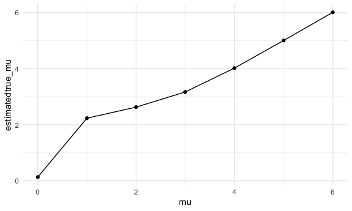

p8105_hw5_akg2197
================
Annie Gorman
2024-11-12

## Loading libraries

# Problem 2

### Function and map

``` r
sim_function <- function(n = 30, mu = 0, sigma = 5) {
  sim_data = tibble(
    x = rnorm(n, mean = mu, sd = sigma)
  )
  test = t.test(x ~ 1, data = sim_data)
  broom::tidy(test)
}
```

``` r
sim_results = tibble(mu = 0:6) |>
  mutate(
    output_df = map(.x = mu, ~rerun(5000, sim_function(n = 30, mu=.x))) ,
    value_df = map(output_df, bind_rows)
  )
```

``` r
sim_results = sim_results |>
  unnest(value_df) |>
  select(estimate, p.value, mu) |>
  mutate(significant_results = as.numeric(p.value < 0.05))
```

### Let’s make some plots using the above function outputs

#### Plot showing the proportion of times the null was rejected (the power of the test) on the y axis and the true value of mu on the x axis:

``` r
sim_results |>
  group_by(mu) |>
  summarize(power = mean(significant_results)) |>
  ggplot(aes(x = mu, y = power)) + 
  geom_path() 
```


From this plot, we can see that as effect size increases, so does power.
Although this relationship is not linear, we do observe a direct
relationship between effect size and power. Effect size describes the
difference between the true statistics and the null statistics.

#### Plot showing the average estimate of mu on the y axis and the true value of mu on the x axis

``` r
sim_results |>
  group_by(mu) |>
  summarize(estimatedtrue_mu = mean(estimate)) |>
  ggplot(aes(x = mu, y = estimatedtrue_mu)) + 
  geom_point() + 
  geom_path() 
```


#### Avg estimate of mu where y = null was rejected and x = true value of mu

``` r
sim_results |>
  filter(significant_results == 1) |>
  group_by(mu) |>
  summarize(estimatedtrue_mu = mean(estimate)) |>
  ggplot(aes(x = mu, y = estimatedtrue_mu)) + 
  geom_point() + 
  geom_path() 
```



When mu is equal to 1, 2, or 3, the the sample average of mu across
tests for which the null is rejected is NOT equal to the true value of
mu. For mu = 4, 5, or 6, the average of mu is approximately equal to the
true value of mu. This is because higher values lead to rejection of the
mu (significant result). However, when we have smaller values like 1, 2,
or 3, a smaller proportion of the sample gets rejected, and many of
those values will have sample values larger than the true mu. This would
result in unequal sample averages to the true mu, especially sample
averages that are higher than the true mu.

# Problem 3

#### Reading in raw data and making city state variable

``` r
homicide_df <- read_csv("homicide-data.csv") |>
    mutate(city_state = map2(city, state, ~ paste(.x, .y, sep = ","))) 
```

    ## Rows: 52179 Columns: 12
    ## ── Column specification ────────────────────────────────────────────────────────
    ## Delimiter: ","
    ## chr (9): uid, victim_last, victim_first, victim_race, victim_age, victim_sex...
    ## dbl (3): reported_date, lat, lon
    ## 
    ## ℹ Use `spec()` to retrieve the full column specification for this data.
    ## ℹ Specify the column types or set `show_col_types = FALSE` to quiet this message.

This raw data includes variables of homicides, including ID number
sequence, date homicide was reported, victim race, age, last name, first
name, and sex, as well as the city, state, latitude, and longitude where
the murder was committed. Disposition (details of arrest) is also
included. I added the city, state variable here.

#### City/state variable and summarizing homicides

I already created my city, state variable. Now, I will be summarizing
within cities to obtain the total number of homicides and the number of
unsolved homicides (those for which the disposition is “Closed without
arrest” or “Open/No arrest”). To do this, I will create a new df
filtering disposition by “closed without arrest” and “open/no arrest”
and merge it with the originial homicide dataframe so we have unsolved
homicides for each city/state.

``` r
unsolved_counts <- homicide_df |>
  filter(disposition %in% c("Closed without arrest", "Open/No arrest")) |>
  group_by(city_state) |>
  summarise(unsolved_count = n(), .groups = "drop")
```

Merging the data frames back together:

``` r
homicide_df <- homicide_df |>
  left_join(unsolved_counts, by = "city_state")
```
