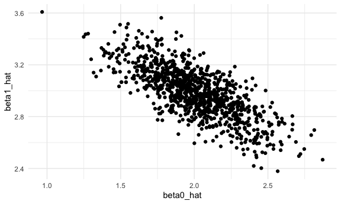

p8105_hw5_akg2197
================
Annie Gorman
2024-11-12

## Loading libraries

# Problem 2

### Function and map

``` r
sim_function <- function(n = 30, mu = 0, sigma = 5) {
  sim_data = tibble(
    x = rnorm(n, mean = mu, sd = sigma)
  )
  test = t.test(x ~ 1, data = sim_data)
  broom::tidy(test)
}
```

``` r
sim_results = tibble(mu = 0:6) |>
  mutate(
    output_df = map(.x = mu, ~rerun(5000, sim_function(n = 30, mu=.x))) ,
    value_df = map(output_df, bind_rows)
  )
```

``` r
sim_results = sim_results |>
  unnest(value_df) |>
  select(estimate, p.value, mu) |>
  mutate(significant_results = as.numeric(p.value < 0.05))
```

### Let’s make some plots using the above function outputs

Plot showing the proportion of times the null was rejected (the power of
the test) on the y axis and the true value of mu on the x axis:

``` r
sim_results |>
  group_by(mu) |>
  summarize(power = mean(significant_results)) |>
  ggplot(aes(x = mu, y = power)) + 
  geom_path() 
```


